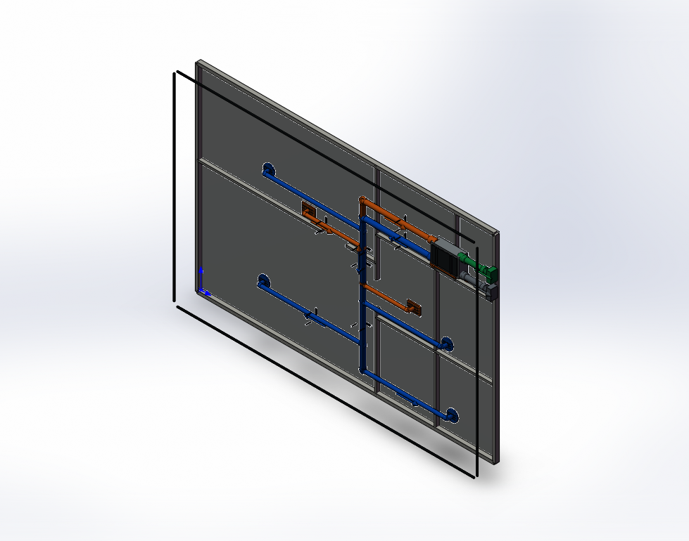
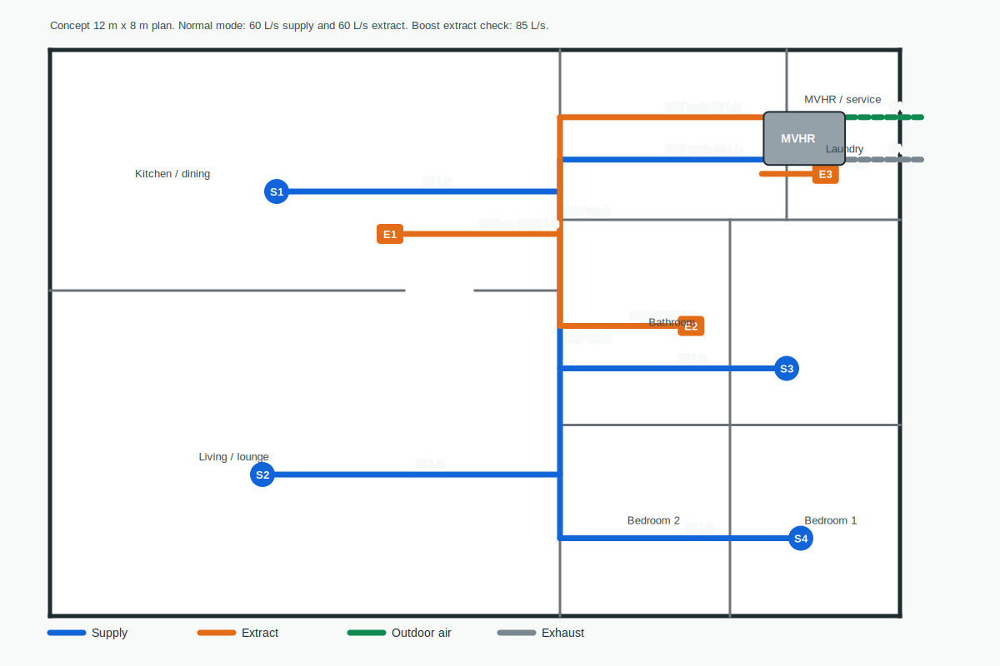
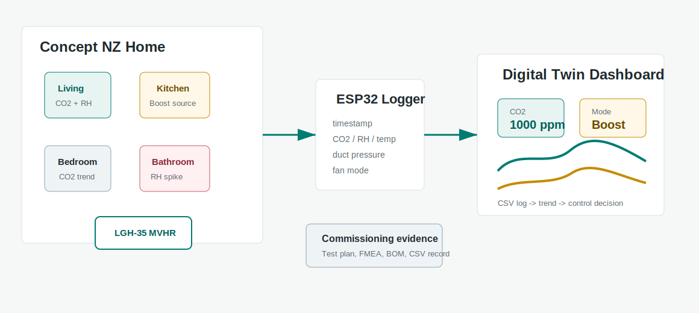
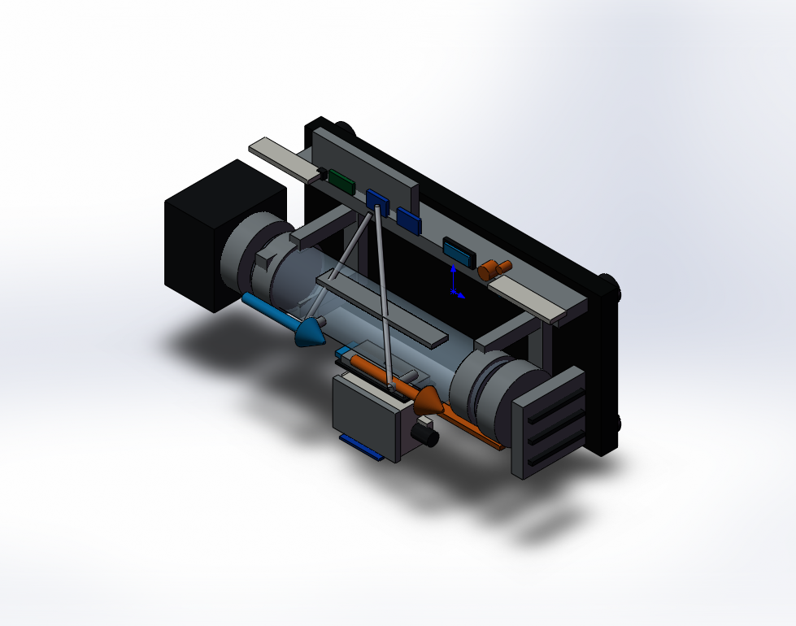

# Smart NZ Home MVHR / ERV Ventilation System

Self-directed New Zealand residential ventilation case study combining 3D CAD layout, SolidWorks API automation, airflow scheduling, duct velocity checks, first-pass pressure-loss estimation, equipment selection, sensor validation planning and a lightweight digital-twin dashboard.

This repository is structured as a portfolio engineering project, not a consent design or professional compliance statement.

## Engineering Scope

- MVHR / ERV unit layout for a concept New Zealand three-bedroom home.
- Routed supply, extract, outdoor intake and exhaust systems.
- Diffusers, grilles, collars, hangers, outdoor terminals and airflow markers.
- C# SolidWorks API model generation workflow.
- AutoCAD-readable 2D DXF ventilation plan.
- Normal balanced airflow case: 60 L/s supply and 60 L/s extract.
- Boost / extractor check case: 85 L/s extract target.
- Preliminary fan-duty targets: about 80 Pa normal mode and 120 Pa boost mode.
- Concept MVHR unit selection: Mitsubishi Electric Lossnay LGH-35RVX3-E.
- Commissioning test plan with pass/fail criteria.
- Sensor-validation architecture using CO2, RH, temperature, pressure and fan-mode data.
- Python Streamlit dashboard prototype for data review and control-state explanation.
- Requirements, stakeholder analysis, trade study and FMEA.
- Concept sensor-pod mounting plate DXF and sensor BOM.
- SolidWorks validation-kit model with test duct, sensor pod, electronics tray, pressure taps, fan module and flow-conditioning features.
- M-101 style design review sheet for interview/portfolio discussion.
- NZ reference check matrix, fan/energy/noise sense check, manufacturing package and evidence-gap register.

## Repository Structure

- `source/solidworks/` - native SolidWorks part file.
- `source/scripts/` - C# SolidWorks API generation script and PowerShell build helper.
- `exports/` - STEP and STL model exports.
- `drawings/` - 2D DXF ventilation plan for AutoCAD.
- `docs/` - component list, airflow schedule, pressure estimate, design notes, test plan and FMEA.
- `data/` - sample commissioning CSV log for the digital-twin workflow.
- `dashboard/` - Python Streamlit dashboard prototype.
- `firmware/` - ESP32 logging skeleton for future sensor tests.
- `images/` - rendered isometric system view.

## Key Files

- `source/solidworks/NZ_Home_Ventilation_System.SLDPRT`
- `source/solidworks/Smart_Ventilation_Validation_Kit.SLDPRT`
- `source/scripts/BuildNzHomeVentilationSystem.cs`
- `source/scripts/BuildSmartVentilationValidationKit.cs`
- `docs/nz_ventilation_airflow_schedule.csv`
- `docs/nz_ventilation_duct_pressure_estimate.csv`
- `docs/nz_ventilation_preliminary_design_note.md`
- `docs/nz_ventilation_equipment_selection.md`
- `docs/smart_validation_kit_design_note.md`
- `docs/smart_validation_kit_component_list.csv`
- `docs/smart_validation_kit_manufacturing_package.md`
- `docs/smart_validation_kit_bom_cost.csv`
- `docs/nz_ventilation_reference_check_matrix.md`
- `docs/nz_ventilation_fan_energy_noise_check.md`
- `docs/nz_ventilation_future_physical_test_items.md`
- `docs/nz_ventilation_evidence_gap_register.md`
- `docs/nz_ventilation_commissioning_test_plan.md`
- `docs/nz_ventilation_requirements_trade_fmea.md`
- `docs/nz_ventilation_digital_twin_method.md`
- `docs/nz_ventilation_sensor_bom.csv`
- `data/nz_ventilation_commissioning_sample.csv`
- `dashboard/ventilation_dashboard.py`
- `drawings/nz_home_ventilation_layout.dxf`
- `drawings/nz_ventilation_sensor_pod_plate.dxf`
- `drawings/nz_ventilation_m101_design_review_sheet.svg`

## Preview










## Dashboard Prototype

The dashboard can be run locally after installing Streamlit and pandas:

```powershell
pip install streamlit pandas
streamlit run dashboard/ventilation_dashboard.py
```

It reads `data/nz_ventilation_commissioning_sample.csv`, displays CO2/RH/airflow trends and explains whether the system should stay in normal mode, move to boost mode or remain in a recovery state.

## Notes

The model uses New Zealand building-services context from NZBC G4 ventilation, H1 energy efficiency and Healthy Homes ventilation guidance as project references. The current limitations are no real architectural plan, no measured airflow balancing data, no diffuser/grille manufacturer data, no acoustic check and no professional compliance review.
